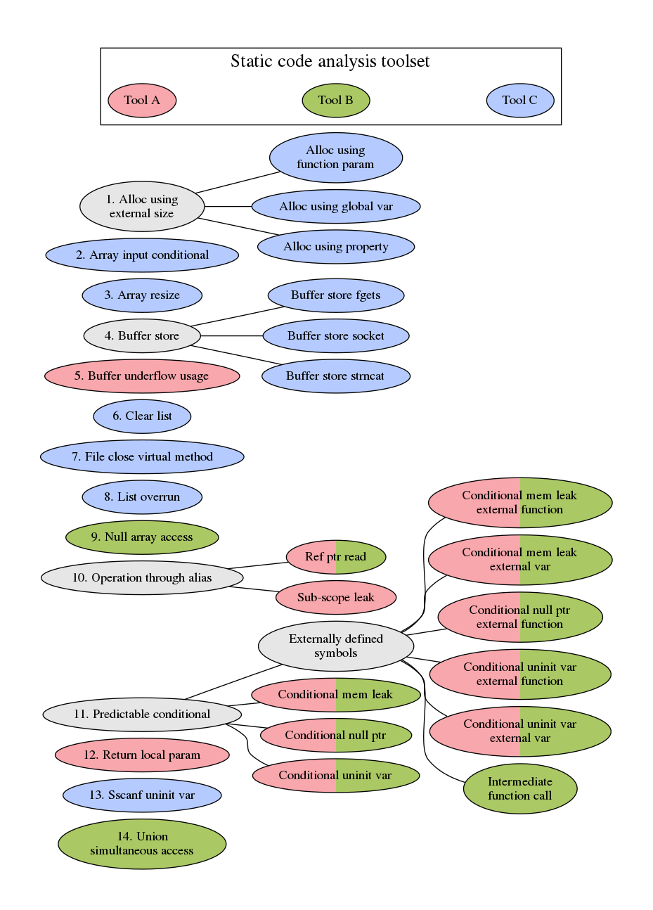

# False Positive Catalog

Here are source code snippets of the false positive patterns listed on the 
[False Positive Catalog](https://github.com/SEDS/mangrove-catalog/wiki) 
wiki page. Rather than browsing the repo here, we recommend that you let the 
wiki page guide you through the patterns.

Our false positive catalog is hierarchical, but we use a flat organization structure for storing the code snippets. Code snippets for a pattern reside in a directory of the same name as the pattern. Each code 
snippet is the minimized structure to reproduce the false warning. We simplified 
the structures (e.g. replacing variables with literal constant values, combining 
variable declaration and initialization, etc.) as long as the false positive did 
not go away or was converted to a true positive.

Each code snippet is annotated with the following details:

* Juliet test case from which the snippet is derived
* Name of the false positive structure
* False warning for each static code analysis tool
* For *changes* (see below), a description of what was changed in the code.

Unless noted otherwise in the code, snippets are self-contained and do not need 
external libraries to be compiled (e.g. no need for Juliet test case support).

## Changes

Some directories have more than one code snippet. In this case, the additional 
code snippets are called *changes*. These changes are numbered arbitrarily, and 
the number is given in the code snippet's filename.

For example, here are two of the files in the "list-overrun" directory:

* `list-overrun.cpp` - reduced code containing the false positive
* `list-overrun_01.cpp` - modified version that introduces a change that causes the false positive to go away

Changes are small edits to the original false positive pattern in an effort to 
identify what is causing the false positive. (A typical change ends up simplifying 
the code structure to the point where the static code analysis tool can reason 
through the situation and not flag a false positive.) Code snippets for changes are 
commented with a brief phrase that describes how the code was modified. Each change 
is performed independently against the original code.

## Toolset

* Tool A
* Tool B
* Tool C

## False Positive Hierarchy Graph

Here is a visualization of the hierarchical nature of the catalog. Some patterns 
are variations of one another, causing them to be leaves of the same "parent" 
false positive pattern. Asterisks denote false positive patterns that we found 
in code other than the Juliet test suite (see wiki page for details).

